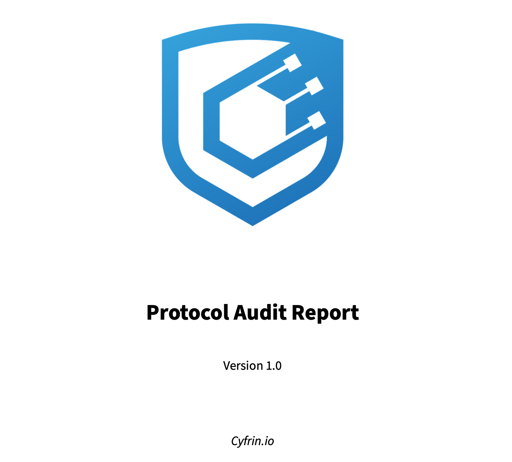

# How to generate a PDF audit report

<br/>
<p align="center">
<a href="https://cyfrin.io" target="_blank">

</a>
</p>
<br/>


1. Add all your findings to a markdown file like `report-example.md`
   1. Add the metadata you see at the top of that file
2. Install [pandoc](https://pandoc.org/installing.html) & [LaTeX](https://www.latex-project.org/get/)
   1. You might also have to install [one more package](https://github.com/Wandmalfarbe/pandoc-latex-template/issues/141) if you get `File 'footnotebackref.sty' not found.`
4. Download `eisvogel.latex` and add to your templates directory (should be `~/.pandoc/templates/`)
5. Add your logo to the directory as a pdf named `logo.pdf`
6. Run this command:
```
pandoc report-example.md -o report.pdf --from markdown --template=eisvogel --listings
```

# FAQ

Certain characters like `⠆` do not work with pandoc, and you'll need to remove them to generate your final report. 
