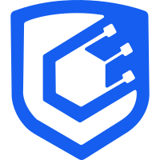

<!DOCTYPE html>
<html>
<head>

</head>
<body>

    
    

    <h1>Protocol Audit Report</h1>
    <h3>Prepared by: Cyfrin</h3>
    

</body>
</html>

<!-- Your report starts here! -->

# Table of Contents
- [Table of Contents](#table-of-contents)
- [Protocol Summary](#protocol-summary)
- [Disclaimer](#disclaimer)
- [Risk Classification](#risk-classification)
- [Audit Details](#audit-details)
  - [Scope](#scope)
  - [Roles](#roles)
- [Executive Summary](#executive-summary)
  - [Issues found](#issues-found)
- [Findings](#findings)
- [High](#high)
- [Medium](#medium)
- [Low](#low)
- [Informational](#informational)
- [Gas](#gas)

# Protocol Summary

Protocol does X, Y, Z

# Disclaimer

The YOUR_NAME_HERE team makes all effort to find as many vulnerabilities in the code in the given time period, but holds no responsibilities for the findings provided in this document. A security audit by the team is not an endorsement of the underlying business or product. The audit was time-boxed and the review of the code was solely on the security aspects of the Solidity implementation of the contracts.

# Risk Classification

|            |        | Impact |        |     |
| ---------- | ------ | ------ | ------ | --- |
|            |        | High   | Medium | Low |
|            | High   | H      | H/M    | M   |
| Likelihood | Medium | H/M    | M      | M/L |
|            | Low    | M      | M/L    | L   |

We use the [CodeHawks](https://docs.codehawks.com/hawks-auditors/how-to-evaluate-a-finding-severity) severity matrix to determine severity. See the documentation for more details.

# Audit Details 
## Scope 
## Roles
# Executive Summary
## Issues found
# Findings
# High
# Medium
# Low 
# Informational
# Gas 
